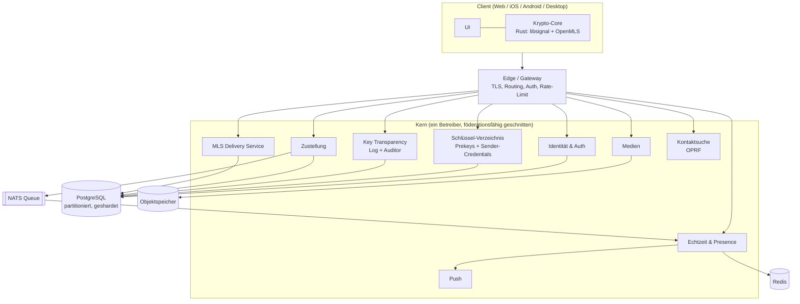

# Architektur

Das Backend besteht aus einer Handvoll Go-Dienste, jeder mit einer klaren Aufgabe und jeder für sich skalierbar. Die Krypto sitzt nicht im Backend, sondern in einem gemeinsamen Rust-Core auf den Clients (libsignal und OpenMLS), gebaut als WebAssembly fürs Web und als native Bibliothek über FFI für mobile und Desktop. Das Backend hält und verteilt Chiffretext und kümmert sich um alles, was nicht geheim ist.

Clients reden über eine Edge-Schicht mit dem Kern: REST für alles, was du auslöst, eine dauerhafte WebSocket-Verbindung für alles, was der Server von sich aus schickt.

## Überblick

## Die Dienste

| Dienst | Aufgabe |
|--------|---------|
| Edge / Gateway | TLS, Routing, Auth-Prüfung, Rate-Limiting. Hält die WebSocket-Verbindungen. |
| Identität & Auth | Konten, Login, Sessions, Geräteverwaltung. |
| Schlüssel-Verzeichnis | Prekeys der Geräte (klassisch und post-quantum) und die Sender-Credentials für Sealed Sender. |
| Key Transparency | Das nachprüfbare Schlüssel-Log samt Auditor-Schnittstelle. Eigenes Subsystem, siehe [specs/key-transparency.md](specs/key-transparency.md). |
| Zustellung | Nimmt Chiffretext an, legt ihn ab, stellt zu (store-and-forward bis zur Abholung). |
| MLS Delivery Service | Verteilt Handshake- und Anwendungsnachrichten der Gruppen. Heikles Stück, eigene Spec in [specs/mls-delivery-service.md](specs/mls-delivery-service.md). |
| Echtzeit & Presence | WebSocket-Fanout, Online-Status, Tippanzeigen. |
| Medien | Verschlüsselte Datei-Uploads im Objektspeicher. |
| Kontaktsuche | Löst Handles per OPRF zu Konten auf, ohne den Suchverlauf preiszugeben, siehe [specs/contact-discovery.md](specs/contact-discovery.md). |
| Push | Weckt mobile Geräte über APNs und FCM. |

Datenhaltung: PostgreSQL (pro Dienst ein Schema, die Nachrichtentabelle nach Monat partitioniert, geshardet nach Konto-ID), Redis für Presence und Zähler, ein Objektspeicher für Medien, eine NATS-Queue fürs Fanout, dazu der Merkle-Store der Key Transparency.

## Was der Server trotzdem sieht

"Zero Knowledge" gilt für den Inhalt, nicht für alles. Der Zustelldienst muss wissen, an welche Geräte er ausliefert. Bei Gruppen heißt das: Er sieht pro Zustellung, welche Geräte zu einer Gruppe gehören, die Mitgliedschaft ist also vor dem Betreiber nicht geheim. Push geht noch weiter, dazu in der [sicherheit.md](sicherheit.md).

## Die teuren Pfade

Post-Quantum ist nicht gratis. Ein ML-KEM-768-Schlüssel ist rund 1,2 KB statt der 32 Byte bei X25519, ein PQXDH-Handshake entsprechend schwerer. Das macht das Schlüssel-Verzeichnis zum Ziel: Wer Prekey-Bündel in Masse abfragt, erzeugt Last und leert Vorräte. Gegenmittel sind Rate-Limits pro Abrufer, ein Pool von etwa 100 Einmal-Prekeys je Gerät mit Nachfüllen ab 20 verbleibenden, und atomare Konsumierung mit `FOR UPDATE SKIP LOCKED`, damit zwei gleichzeitige Abrufe nicht denselben Einmal-Prekey ziehen.

## Skalierung

Die zustandslosen Dienste skalieren waagerecht. Die heißen Pfade sind Echtzeit und Zustellung, und die skalieren unabhängig. Ein WebSocket-Knoten hält je nach Ausstattung mehrere hunderttausend Verbindungen, eine Nachricht findet über die Queue den Knoten mit der Zielverbindung. Presence liegt in Redis mit gebündelten Updates, geshardet wird nach Konto-ID, Offline-Geräte weckt Push.

## Föderation, vorbereitet aber aus

Intern hat jede Identität die Form `handle@home-server`, auch wenn es vorerst nur einen Server gibt. Eine Server-zu-Server-Schnittstelle ist grob umrissen, aber abgeschaltet. Das de-riskt die Benennung, mehr nicht. Echte Föderation braucht serverübergreifende Key Transparency, Server-Discovery und S2S-Authentifizierung, und sie weicht den Metadatenschutz auf. Sie bleibt eine Option für später, Abwägung in [ADR-0001](entscheidungen/0001-hybrid-kern.md).

## Eine Nachricht von A nach B

A verschlüsselt im Krypto-Core lokal, einmal für jedes Gerät von B und für die eigenen Zweitgeräte gleich mit. Der Chiffretext geht in eine Sealed-Sender-Hülle und per Edge an die Zustellung, die ihn ablegt und ein Ereignis in die Queue schreibt. Die Echtzeit-Schicht stupst B an, B holt die Hülle und entschlüsselt sie auf dem Gerät. Der Server sieht nie Klartext, und bei den meisten Nachrichten dank Sealed Sender nicht mal den Absender. Der Ablauf im Detail steht in [specs/sealed-sender-und-abuse.md](specs/sealed-sender-und-abuse.md).
