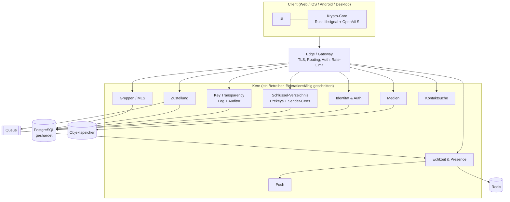

# Architektur

Das Backend besteht aus einer Handvoll Dienste, jeder mit einer klaren Aufgabe und jeder für sich skalierbar. Die ganze Krypto steckt nicht im Backend, sondern in einem gemeinsamen Rust-Core, der auf den Clients läuft. Das Backend speichert und verteilt Chiffretext und kümmert sich um alles, was nicht geheim ist.

Die Dienste schreibe ich in Go. Der Krypto-Core ist Rust (libsignal und OpenMLS), einmal geschrieben und über alle Clients geteilt: als WebAssembly im Browser, über FFI in den nativen Apps. So gibt es genau eine Implementierung der heiklen Teile, statt vier leicht unterschiedliche. Welche Sprache die Realtime-Schicht am Ende fährt, ist noch nicht in Stein, siehe [offene-fragen.md](offene-fragen.md).

## Überblick

## Die Dienste

| Dienst | Aufgabe |
|--------|---------|
| Edge / Gateway | TLS, Routing, Auth-Prüfung, Rate-Limiting. Hält die WebSocket-Verbindungen. |
| Identität & Auth | Konten, Login, Sessions, Geräteverwaltung. |
| Schlüssel-Verzeichnis | Prekeys der Geräte (klassisch und post-quantum) und die Sender-Certificates für Sealed Sender. |
| Key Transparency | Das nachprüfbare Schlüssel-Log samt Auditor-Schnittstelle. Eigenes Subsystem, Details in [specs/key-transparency.md](specs/key-transparency.md). |
| Zustellung | Nimmt Chiffretext an, legt ihn ab, stellt zu. Store-and-forward bis das Gerät abholt. |
| Gruppen / MLS | Der Delivery Service für MLS: verteilt Handshake- und Anwendungsnachrichten an die Mitgliedsgeräte. |
| Echtzeit & Presence | WebSocket-Fanout, Online-Status, Tippanzeigen. |
| Medien | Verschlüsselte Datei-Uploads, liegen im Objektspeicher. |
| Kontaktsuche | Löst Handles zu Konten auf, ohne das Adressbuch mitzulesen. |
| Push | Weckt mobile Geräte über APNs und FCM. |

Dahinter: PostgreSQL (pro Dienst ein Schema, geshardet nach Konto-ID), Redis für Presence und Zähler, ein Objektspeicher für Medien, eine Queue fürs Fanout.

## Was der Server trotzdem sieht

Wichtig, weil man es leicht schönredet. "Zero Knowledge" gilt für den Inhalt, nicht für alles. Der Zustelldienst muss wissen, an welche Geräte er ausliefert, sonst kann er nicht zustellen. Bei Gruppen heißt das: Er sieht pro Zustellung, welche Geräte zu einer Gruppe gehören. Die Gruppenmitgliedschaft ist also kein Geheimnis vor dem Betreiber, nur der Inhalt ist es. Push geht noch einen Schritt weiter, dazu unten.

## Warum Dienste und kein Monolith

Die heißen Pfade sind Echtzeit und Zustellung. Wenn abends alle gleichzeitig schreiben, soll genau der Teil hochskalieren, ohne dass die Geräteverwaltung mitwächst. Getrennte Dienste machen das möglich und halten Ausfälle lokal. Fällt die Kontaktsuche aus, laufen die Chats weiter.

Am ersten Tag müssen nicht zehn Deployments stehen. Die Grenzen sind sauber gezogen, anfangs dürfen mehrere Dienste im selben Prozess sitzen. Wächst die Last, zieht man sie auseinander.

## Echtzeit, Skalierung und die teuren Pfade

Die WebSocket-Knoten sind zustandslos und untereinander austauschbar. Eine Nachricht findet über die Queue den Knoten, der die Zielverbindung hält. Presence läuft über Redis mit gebündelten Updates. Geshardet wird nach Konto-ID. Offline-Geräte weckt Push.

Ein Punkt, den man früh bedenken muss: Post-Quantum ist nicht gratis. Ein PQXDH-Handshake ist deutlich teurer als reines X25519, und ML-KEM-Schlüssel sind rund ein Kilobyte statt 32 Byte. Damit wird das Schlüssel-Verzeichnis zu einem Ziel: Wer massenhaft Prekey-Bündel abfragt, erzeugt Last und leert Prekey-Vorräte. Gegenmaßnahmen (Rate-Limits pro Abrufer, Quotas, Fallback-Verhalten bei leerem Vorrat) gehören in [offene-fragen.md](offene-fragen.md) und sind noch nicht fertig entschieden.

## Föderation, vorbereitet aber aus

Intern hat jede Identität die Form `handle@home-server`, auch wenn es vorerst nur einen Server gibt. Eine Server-zu-Server-Schnittstelle ist grob umrissen, aber abgeschaltet. Damit verbauen wir uns den Weg nicht, mehr verspricht die Vorbereitung aber auch nicht. Echte Föderation ist kein Schalter: Sie braucht serverübergreifende Key Transparency, ein Server-Discovery-Protokoll und S2S-Authentifizierung, und sie weicht den Metadatenschutz auf. Matrix hat sich daran jahrelang abgearbeitet. Deshalb bleibt Föderation eine bewusste Option für später, standardmäßig aus. Abwägung in [ADR-0001](entscheidungen/0001-hybrid-kern.md).

## Eine Nachricht von A nach B

A verschlüsselt im Krypto-Core lokal, einmal für jedes Gerät von B und für die eigenen Zweitgeräte gleich mit. Der Chiffretext geht in eine Sealed-Sender-Hülle und per Edge an die Zustellung, die ihn ablegt und ein Ereignis in die Queue schreibt. Die Echtzeit-Schicht stupst B an, B holt die Hülle und entschlüsselt sie auf dem Gerät. Der Server sieht nie Klartext, und bei den meisten Nachrichten dank Sealed Sender nicht mal den Absender. Den Ablauf im Detail, samt Sender-Certificate, beschreibt [specs/sealed-sender-und-abuse.md](specs/sealed-sender-und-abuse.md).
